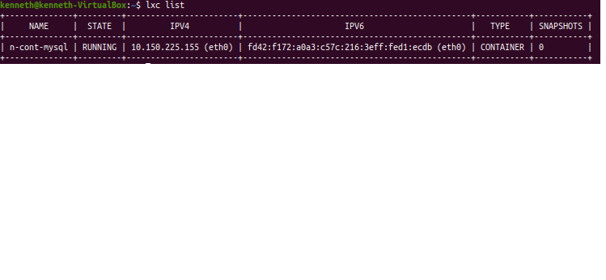

# LXC/LXD

Esta carpeta contiene el paso a paso para acceder al servidor MySQL en un ambiente LXD
Ejecutar sobre una versión del kernel de linux 5.10.19

## Configuracion inicial

- Una vez se tenga instalado y se inicie el comando `sudo lxd init` se recomienda dejar las configuraciones por defecto.
- Es importante que se intale el servidor `MySQL` en el host de la maquina donde trabaje. Para ello puede utilizar el comando:
  Instalar MySQL: `sudo apt install mysql-server `

## Procedimiento

-Creacion de un nuevo contenedor (LXC) , para implementar `MySQL`, se toma como ejemplo la version `ubuntu:18.04` , y el contenedor se denota con el nombre `n-cont-mysql`, este nombre varia segun el gusto del programador:

- Crear contenedor : `lxc launch ubuntu:18.04 n-cont-mysql`
- Inicio de sesion en el contenedor creado (n-cont-mysql) .
- Abrir contenedor : `lxc exec n-cont-mysql bash`

  ahora si en el contenedor creo mysql:

- _Creacion de contenedor_

- Instalar lxc: `sudo apt install lxc`
- Instalar lxd: `sudo snap install lxd`
- Inicializar lxd con: `lxd init`
- Crear cualquier contenedor: `lxc launch imageserver:imagename instancename`
- Instanciar cualquier contenedor: `lxc start instancename`
  [ver mas](https://linuxcontainers.org/lxd/getting-started-cli/)

## Ejecución

Después de configurar lxd, para ejecutar las pruebas en lxd se debe ejecutar el archivo `scripts/stress_lxd.sh` el cual realiza lo siguiente

- Crear contenedor de prueba: `lxc launch ubuntu:20.10 lxdtest`
- Instanciar contenedor de prueba: `lxc start lxdtest`
- Instalar stress-ng en el contenedor: `lxc exec lxdtest -- snap install stress-ng`

### Stress-ng

EL comando que ejecuta todas las pruebas es el siguiente para el contenedor $CONTAINER y el tiempo de ejecución $TIMEOUT

`lxc exec $CONTAINER -- stress-ng --cpu 4 --timeout $TIMEOUT --metrics --log-file /root/stress_test.log`

Los resultados del test quedan guardados en /root/stress_test.log en el contenedor, y pueden consultarse extrayendo el archivo mediante

`lxc file pull $CONTAINER/root/stress_ng.log .`
