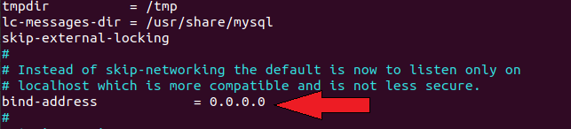

# LXC/LXD

Esta carpeta contiene el paso a paso para acceder al servidor MySQL en un ambiente LXD
Ejecutar sobre una versión del kernel de linux 5.10.19

## Configuracion inicial

- Una vez se tenga instalado LXC y LXD y se inicie el comando `sudo lxd init` se recomienda dejar las configuraciones por defecto.
- Es importante que se intale el servidor `MySQL` en el host de la maquina donde trabaje. Para ello puede utilizar el comando:

-Instalar MySQL: `sudo apt install mysql-server `

## Procedimiento

### 1) Creacion de un nuevo contenedor (LXC) , para implementar `MySQL`, se toma como ejemplo la version `ubuntu:18.04` , y el contenedor se denota con el nombre `n-cont-mysql`, este nombre varia segun el gusto del programador:

-Crear contenedor : `lxc launch ubuntu:18.04 n-cont-mysql`

### 2) Instalar dentro del contenedor MySQL:

Inicio de sesion en el contenedor creado (n-cont-mysql):

-Abrir contenedor : `lxc exec n-cont-mysql bash`

Dentro del contenedor crear o instalar _MySQL_:

-Actualizacion en contenedor: `sudo apt update `

-Instalar MySQL en contenedor:`sudo apt install mysql-server`

-Inicie y Verifique estado del servicio MySQL: `systemctl start mysql` luego `systemctl status mysql`, se obtiene lo siguiente:

### 3) Para que el servidor acepte conexiones de equipos remotos convendrá substituir dentro de las configuraciones del MySQL el `bind-address` cambiando de `127.0.0.1` por `0.0.0.0` para que el servidor abra un puerto en todas las interfaces de red.

-Ubicarse dentro del contenedor (creado con MySQL) con: `lxc exec n-cont-mysql bash`

-valide y compruebe las direcciones de red : `netstat -plnt`, si no ha configurado aun el acceso remoto, se tiene lo siguiente:

-Configurar el acceso remoto, abro _mysqld.cnf_, para configurar los cambio deseados: ` vi /etc/mysql/mysql.conf.d/mysqld.cnf`

Cambio de _bind-address_ de _127.0.0.1 por 0.0.0.0_

-Reinicie _MySQL_, para que se apliquen los cambios: `systemctl restart mysql`

-Si no se aplican cambios pare `systemctl stop mysql` y luego aplique `systemctl restart mysql`

-valide y compruebe las direcciones de red nuevamente: `netstat -plnt`, si hizo los cambios debe tener lo siguiente:

### 4) Obtener la ip del host y contenedor para hacer la comunicación:

-Obtener la ip del Host , para ello ir a la terminal del host y el comando: `ifconfig`

-Obtener la ip del contenedor con MySQL, para ello hay dos formas:

\ -Una opcion es desde la terminal del contenedor del ejemplo (`n-cont-mysql`) y digitando el comando: `ifconfig`

\* Otra opcion es desde el host, con el comando: `lxc list`

### 5) Creando una BBDD, informacion desde el MySQL creado en el contenedor hacia el host:

5.1) Posicionarse en el contenedor y entrar al servidor mysql:

\*Abrir contenedor : `lxc exec n-cont-mysql bash`

\*Entrar al servidor: `mysql -u root -p`

-Dentro del servidor MySQL, crear un nueva nueva base de datos:

\*Creando nueva base, donde el nombre `ejemplo1` puede variar a gusto del programador:

`mysql> CREATE DATABASE ejemplo1;`

\*Asigno todos los privilegios a quien tendra acceso a la BBDD, donde el usuario `usuario_ejemplo`, y la clave `'12345'` puede variar a gusto del programador, y el número ip correspondiente al Host: `10.150.225.1`, se identifica en el punto `4`:

`GRANT ALL PRIVILEGES ON ejemplo1.\* TO usuario_ejemplo@10.150.225.1 IDENTIFIED BY '12345'; `

5.2) Posicionarse en el Host y entrar al servidor mysql, para poder ver la base de datos `ejemplo1` creada en el contenedor , en paso `5.1`

\*Accedo al servicio de MySQL dentro del contenedor:

`mysql -u usuario_ejemplo -h 10.150.225.155 -p12345 ejemplo1`

Donde '12345' es la contraseña puesta en `5.1` , y donde `usuario_ejemplo ` es el usuari creado en `5.1`

\*Visualizar base de datos creada:

`show databases`

